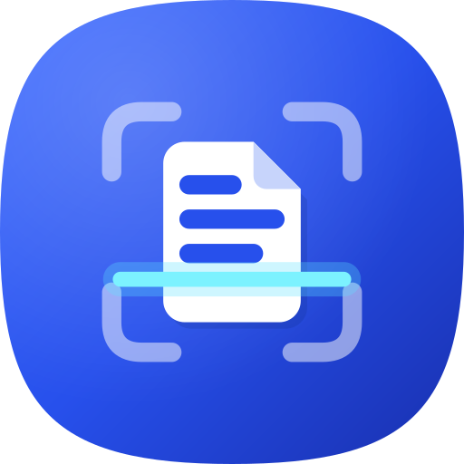

<div align="center">



# Scanni

**A beautiful, modern document scanner for Android — Microsoft Lens, reimagined.**

[](https://github.com/YassineChelly04/scan-app-mobile/actions/workflows/android-ci.yml)
[](https://github.com/YassineChelly04/scan-app-mobile/releases/latest)


</div>

Point your camera at a page: Scanni finds the edges live, captures automatically
when you hold steady, perspective-corrects the page, cleans it up with smart
filters, reads the text on-device, and exports **searchable PDFs**. Everything
stays on your phone — no accounts, no cloud.

## Download

Grab the latest APK from the
[**Releases page**](https://github.com/YassineChelly04/scan-app-mobile/releases/latest)
and install it on your phone (Android 8.0+). Releases ship **per-architecture**
APKs — pick `…-arm64-v8a.apk` for almost any phone from 2017 on (~60 MB), or
the `…-universal.apk` fallback if unsure. OCR models, fonts and vision
libraries are bundled, so everything works fully offline.

## Features

**Capture**
- Live document edge detection (OpenCV) with a smoothed, animated quad overlay
- Auto-capture with a steadiness ring around the shutter + haptic confirmation
- Capture modes: **Document · Whiteboard · Business Card · Photo**, each with
  tuned detection and a matching default filter
- Multi-page scanning with a live page stack, torch, tap-to-focus, and
  gallery import (no storage permission needed — Photo Picker)

**Perfect the page**
- Intelligent crop: detected corners pre-applied, manual editor with draggable
  corners *and* edges plus a magnifier loupe for pixel-accurate placement
- Six filters with live mini-previews: Original, Magic (illumination-flattening
  color), Grayscale, B&W, Whiteboard, Photo
- Rotate, reorder (drag thumbnails), add or delete pages — before *and* after
  saving (every original is kept, edits are always non-destructive)

**Text intelligence**
- On-device OCR in the background: **Latin** scripts via ML Kit v2 and
  **Arabic** via Tesseract 5 (model bundled — works offline from first launch)
- Full-text search across every scanned document, with match snippets
- Copy or share recognized text per document

**Organize & export**
- Library with folders, full-text + title search, and multi-select
- **Searchable PDF** export: recognized words are embedded invisibly at their
  exact positions, so the PDF is selectable and searchable in any viewer
  (Arabic text layer included via an embedded Noto Sans Arabic subset)
- Share pages as images, save PDFs anywhere via the system file picker

**Modern Android, throughout**
- 100% Kotlin + Jetpack Compose, Material 3 with dynamic color & dark theme
- Edge-to-edge, splash screen API, predictive-back ready, full RTL support
- Fully localized in **English and Arabic**

## Build & run

```bash
./gradlew :app:assembleDebug      # build the APK
./gradlew :app:testDebugUnitTest  # run the unit tests
```

Requirements: JDK 17+, Android SDK 35. Min SDK 26 (Android 8.0).
Dependencies resolve from Google Maven, Maven Central, and JitPack
(Tesseract4Android only).

Release builds (`:app:assembleRelease`) are signed with the keystore committed
at `signing/release.keystore` so CI releases and local builds install over each
other. Because that key is public, an APK signature proves nothing about
origin — only download Scanni from this repository's Releases page.

## Project layout

```
app/src/main/java/com/scanni/app/
├── core/        Pure logic: quad geometry, stabilizer, crop math, FTS query,
│                PDF layout — fully unit-tested, zero Android dependencies
├── domain/      Models, repository contracts, use cases, scan session
├── data/        Room DB (FTS4 index), DataStore settings, file store
├── vision/      OpenCV: live detector, frame analyzer, page enhancer/filters
├── ocr/         ML Kit (Latin) + Tesseract (Arabic) engines, WorkManager job
├── export/      Searchable PDF writer (PdfBox), share/clipboard actions
├── di/          Hand-wired AppGraph (no DI framework)
└── ui/          Compose screens: library, scanner, review, document,
                 edit page, settings + shared components & theme
```

See [docs/ARCHITECTURE.md](docs/ARCHITECTURE.md) for the full design — data
flow, the detection pipeline, the searchable-PDF technique, and the reasoning
behind each major decision.

The repo also ships five UI/UX engineering skills under `.claude/skills/`
(design language, motion, stateful screens, touch ergonomics, camera UX) that
govern all front-end work.

## Privacy

Scanni has exactly one permission: the camera. Scans, recognized text and the
search index never leave the device.
